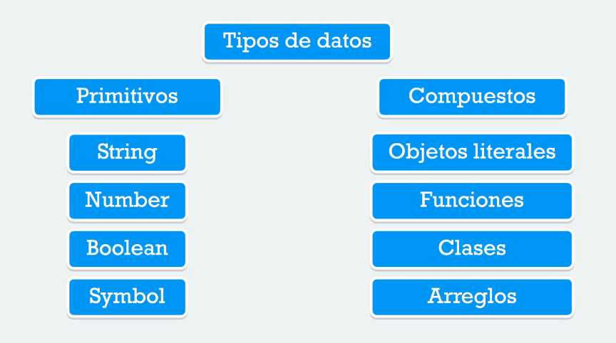
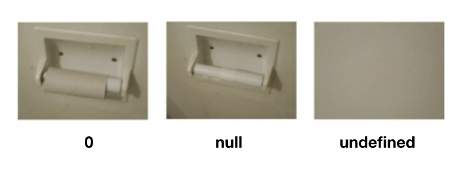

# Apuntes TypeScript

## Instalación y Configuración
Instalación global

```bash
sudo npm install -g typescript
```

**Nota:** *Sólo es necesaria si trabajaremos en modo **standalone** sin ningún framework o tecnología que nos configure TypeScript. En el caso de Windows no es necesario tener privilegios de administrador* 

Verificación de la versión de TypeScript

```bash
tsc --version
```
### Hola Mundo en TypeScript

Archivo `script.ts`

```ts
const msg: string = "Hola Mundo";
console.log(msg);
```

#### Ejecución en el Navegador

Para visualizar la ejecución, es necesario usar la consola de las herramientas de desarrollo del navegador.

Archivo `index.html`

```html
<!DOCTYPE html>
<html lang="en">
<head>
    <meta charset="UTF-8">
    <meta http-equiv="X-UA-Compatible" content="IE=edge">
    <meta name="viewport" content="width=device-width, initial-scale=1.0">
    <title>Bases de Typescript</title>
</head>
<body>

    <script src="script.js"></script>
    
</body>
</html>
```

Transpilación para la generación del archivo `script.js`

```bash
tsc script
```

Generación del archivo `tsconfig.json` para la configuración de la transpilación

```bash
tsc --init
```

Activar el modo "observador" para ejecutar la transpilación al guardar el documento.

```bash
tsc --watch
```

**Nota:** *No finalizar la ejecución de la terminal*

#### Ejecución con `ts-node`

Instalar `ts-node`

```bash
sudo npm install -g ts-node
```

Ejecución del archivo `script.ts` en consola 

```bash
ts-node script.ts
```

**Nota:** *Estar en el mismo directorio del archivo. También es posible realizar la ejecución usando los atajos de la interfaz de Visual Studio Code*

## Variables y Tipos Básicos

Al ser un super-set de JavaScript, posee los mismos tipos de datos con las bondades del tipado estricto



Documentación oficial de TypeScript sobre los tipos de datos [aquí](https://www.typescriptlang.org/docs/handbook/2/everyday-types.html).

### Tipos Primitivos

#### Strings

```ts
let name: string = "María Perez";
let company: string = 'Tesla';
let header: string = `<h1>Hola Mundo</h1>`
```

#### Number

```ts
const PI: number = 3.14159265359;
let salary: number = 1000.0;
let age: number = 29;
```

#### Booleans

```ts
let isActive: boolean = true;
let keepAlive: boolean = false;
```

**Nota:** *En JavaScript podemos asignar valores `null` y `undefined` a un `boolean`, si tenemos el modo estricto activado en TypeScript (Archivo `tsconfig.json`) sólamente podremos asignar `true` o `false` a una variable de tipo `boolean`*

#### Null y Undefined

```ts
let salary = null;
console.log(salary); // null
let personName;
console.log(personName); // undefined
```



#### Symbol

```ts
let sym1: symbol = Symbol("key");
let sym2: symbol = Symbol("key");
console.log(sym1 === sym2); // false, symbols are unique
```

**Nota:** *Documentación oficial de este tipo de dato [aquí](https://www.typescriptlang.org/docs/handbook/symbols.html)*

#### Any

```ts
let salary: any = 1000;
let isActive;
```

**Nota:** *En lo posible no utilizar este tipo de dato*

### Tipos Compuestos

#### Arrays

Declaración e inicialización

```ts
const fruits: string[] = ['apple', 'peach', 'watermelon'];
```

Añadir un elemento al final

```ts
fruits.push('pineapple');
```


*Elaborado por [**David Corredor Ramírez**](https://www.linkedin.com/in/dgcorredorr/)*
